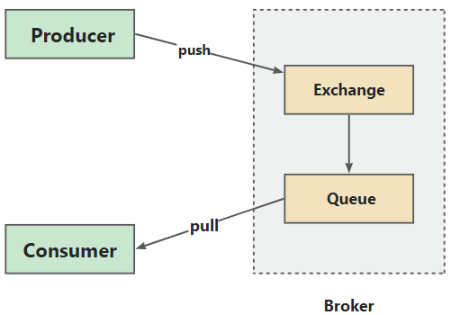
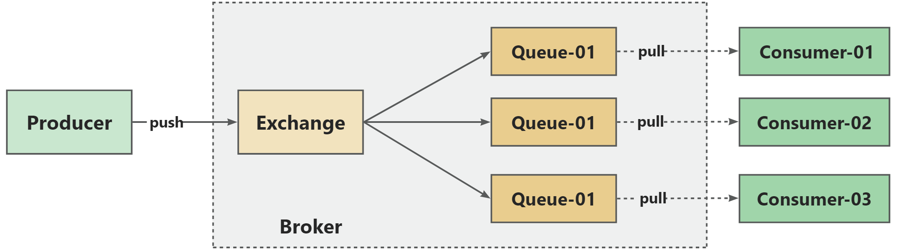
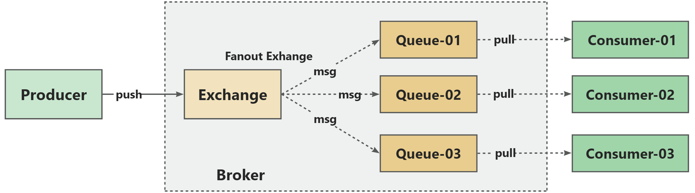
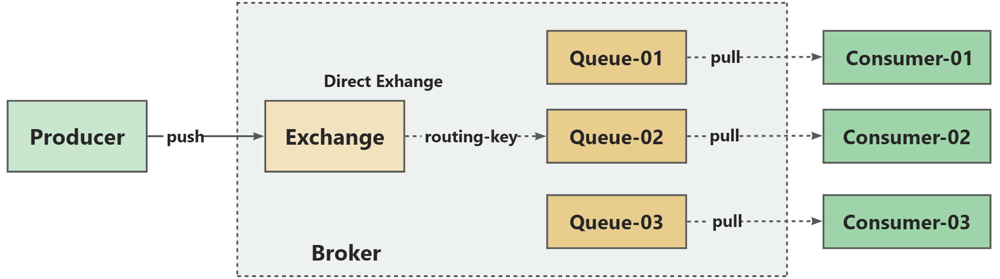
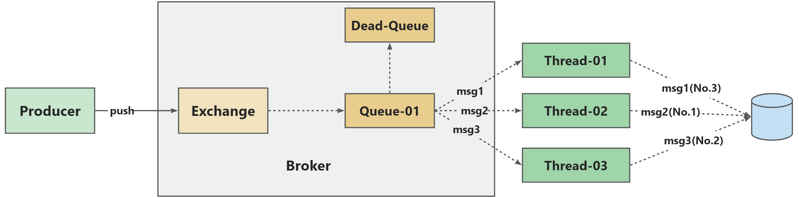
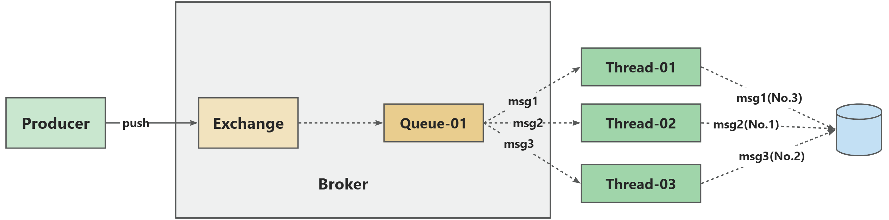
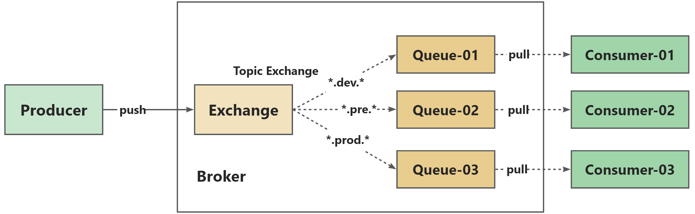

# Common message queuing principles

## RAMQ

RabbitMQ，下文简称 RAMQ.

RAMQ 是一个开源的高性能、可扩展、消息中间件（Message Broker），实现了 Advanced Message Queuing Protocol（AMQP）协议，可以帮助不同应用程序之间进行通信和数据交换。

RAMQ 是由 Erlang 开发的，支持多种编程语言，包括 Java、Python、Ruby、PHP、C# 等。它的核心思想是将**发送者（producer）与接收者（consumer）完全解耦，实现异步处理和低耦合度的系统架构**。

### RAMQ 的消息发送链路

整体发送链路如下图所示：

### RabbitMQ 的消息消费链路

消息先会 exchange 复制，然后派发到多个不同的队列上。同一条消息需要占用多分存储空间，空间利用率不是很高。

下图是以一个主题，1 个 topic 为案例进行讲解。

### Exchange 机制的四种类型

Exchange 机制有 4 中类型，分别是：

- Fanout 类型
- Direct 类型
- Topic 类型
- Header 类型

#### Fanout 类型

我们可以理解为就是广播模式，Fanout 翻译过来就是分列，扇开的意思。

#### Direct 类型

根据 routing_key 将消息投递到指定的队列上。

#### Topic 类型

更加灵活的 routing_key，支持用通配符的方式处理消息的投递。

#### Header 类型

更为细粒度的匹配逻辑，在投递消息的请求头上，注入多个 header 参数，路由规则是根据 header 的参数去决定要投递哪个队列，这种模式比较少用。

### 消息错误处理

消费异常的数据，会被投递到一条死信队列里面，后面重新再拉取消费。

消费端消费消息，写入 db。（db 的连接池满了，数据写入失败。消息重试：晚点再消费一次消息，过一段时间再去消费）。

### 消息顺序消费设计

RabbitMQ 的顺序消费能力不行，消费者如果使用多线程消费，就无法把保证多线程的处理顺序（RocketMQ，Kafka）。

多个消费者对应一条队列，也会有顺序错乱的问题。

什么场景下，才会对顺序消费，要求这么严格 ？ ——（binlog 同步，基于 canal 去做 mysql 的 binlog 订阅，开一个单独的服务，专门接受 binlog 后，会发送 mq 消息出来。）

### 消息的重复存储

假设一条消息，满足匹配规则，需要投递到多个不同的队列上，那么相同的消息需要在不同的队列上都保存一份，重复数据造成占用空间资源浪费。

routing_key:user.dev.prod.id

msg:{"order":11011,"user_id":1011}

Rocketma，Kafka（原始消息存储目录，消息读取索引目录）

## ROMQ

基于 Java 语言实现

## 三中消息队列对比剖析

### 特性对比

|          | RabbmitMQ                                              | RocketMQ                                                     | Kafka                                                        |
| -------- | ------------------------------------------------------ | ------------------------------------------------------------ | ------------------------------------------------------------ |
| 语言     | Erlang                                                 | Java                                                         | Scala/Java                                                   |
| 性能     | 一般                                                   | 强                                                           | 非常强                                                       |
| 消息存储 | 按照 topic 区别存储，消息复制到多个queue中             | 所有topic的消息统一存储在一份commitLog里面                   | 按topic粒度分散在不同的partition中，底层以segment的.log文件为粒度进行存储 |
| 运维难度 | 简单                                                   | 简单                                                         | 高                                                           |
| 适用场景 | 可靠性要求高的消息传递场景，如广告推送，用户状态变更等 | 可以覆盖RabbitMQ的场景；支持事务消息；结合最终一致性思想来用于解决分布式事务；支持延迟消息能力；实时计算，电商秒杀；高性能，高可用计算 | 实时计算，大数据分析；日志采集；事件总线                     |
| 失败重试 | 支持                                                   | 支持                                                         | 需要手动实现                                                 |
| 性能     | 30mb/s                                                 | 650mb/s                                                      | 650mb/s                                                      |

