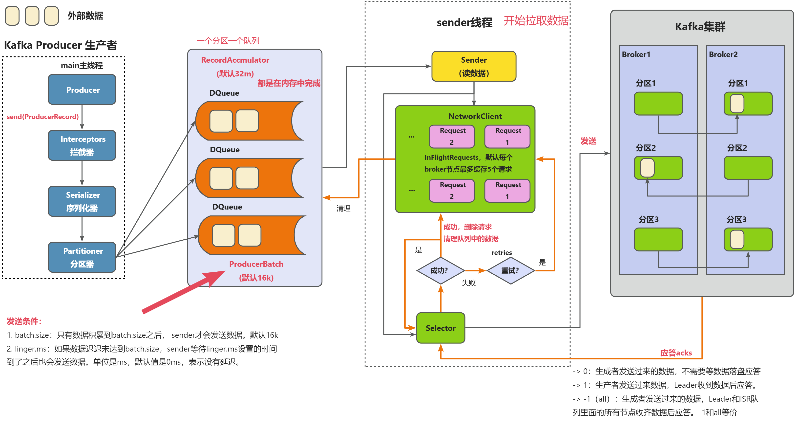

kafka 高性能体现在5个方面：
1. 消息批处理
2. 消息压缩
3. 固化内存池
4. 合适的GC算法配置
5. Partition和LogSegment模块

## 消息批处理

kafka的底层对于消息的发送采用了一种批量推送的功能。
kafka的api提供了一个叫`send()`的函数，当我们调用该函数时并不会立马发送消息给broker，而是有一个批量发送的设计思路。

发送端有个一个专门的队列，当我们从api调用send函数之后，该方法会将传入的message对象先往本地内存的一条队列写入，然后会有一个专门的线程从
队列中提取出元素，批量地往broker端发送。 这样成批地发送数据，可以大大减少单条消息挨个发送所带来的额外的网络开销。

kafka提供4个参数来控制发送端批处理策略：
- `batch.size`：指定每个批次可以收集的消息数量的最大值。默认是16KB
- `buffer.memory`：指定每个Producer可以使用的缓冲区内存的总量。默认是32MB
- `linger.ms`：指定每批次可以等待的时间的最大值。默认是0ms。
- `compression.type`：指定是否对每次批次进行压缩，以及使用哪种压缩算法。默认是 none。

在broker端，面对批量发送过来的消息数据，broker不会将其拆解开来，而是直接写入。这样批量写入是写入了文件内存映射的地址，kafka底层运用了mmap技术，提升了写入磁盘的速率，这样子写磁盘的速度接近于写内存速度，提升了写入的速率。

对于消费端来说，消费者每次会拉取一批的消息到本地进行消费，这种批量消费可以提升消费者的速率。

Kafka通用提供了4个参数来控制消费端的批处理策略：
1. `fetch.min.bytes`：指定每次拉取请求至少要获取多少字节的数据。默认是1B。
2. `fetch.max.bytes`: 指定每次拉取请求最多能获取多少字节的数据。默认是50MB。
3. `fetch.max.wait.ms`：指定每次拉取请求最多能等待多长时间。默认是500ms。
4. `max.partition.fetch.bytes`：指定每个分区每次拉取请求最多能获取多少字节的数据。默认是1MB。

整体细节流程图如下：

## 消息压缩
生产者可以配置`props.put("compression.type", "gzip");` 即可开启 gzip 压缩。另外除Gzip意外，kafka支持配置snappy, lz4压缩算法。

一般来说，我们会在发送端将消息进行压缩，那么broker存储的数据内容就是压缩后的数据，只有当消费者拉取这部分数据进行消费的时候，数据才会被解压。

另外，虽然网上有些文章提到过broker端可以做消息的压缩和解压操作，但是这类做法并不恰当，因为它是一个高计算性的行为，在高并发情况下会大量占用CPU的时间片，所以不推荐在broker做消息的压缩和解压操作。

下图是Facebook Zstandard官网提供的一份压缩算法benchmark比较结果：

| Compressor name         | Ratio | Compression| Decompress.|
| ---------------         | ------| -----------| ---------- |
| **zstd 1.5.6 -1**       | 2.887 |   510 MB/s |  1580 MB/s |
| [zlib] 1.2.11 -1        | 2.743 |    95 MB/s |   400 MB/s |
| brotli 1.0.9 -0         | 2.702 |   395 MB/s |   430 MB/s |
| **zstd 1.5.6 --fast=1** | 2.437 |   545 MB/s |  1890 MB/s |
| **zstd 1.5.6 --fast=3** | 2.239 |   650 MB/s |  2000 MB/s |
| quicklz 1.5.0 -1        | 2.238 |   525 MB/s |   750 MB/s |
| lzo1x 2.10 -1           | 2.106 |   650 MB/s |   825 MB/s |
| [lz4] 1.9.4             | 2.101 |   700 MB/s |  4000 MB/s |
| lzf 3.6 -1              | 2.077 |   420 MB/s |   830 MB/s |
| snappy 1.1.9            | 2.073 |   530 MB/s |  1660 MB/s |

- 吞吐量方面：LZ4 > Snappy > zstd 和 GZIP
- 压缩比方面：zstd > LZ4 > GZIP > Snappy
- 网络带宽：使用 Snappy 算法占用的网络带宽最多，zstd 最少
- CPU使用率：压缩时 Snappy 算法使用的 CPU 较多一些，而在解压缩时 GZIP 算法则可能使用更多的 CPU。

## 固化内存池

Producer 发送消息是批量的，因此消息都会先写入Producer的内存中进行缓冲，直到多条消息组成了一个Batch，才会通过网络将Batch发个Broker。

当这个Batch发送完毕后，显然这部分数据还会在Producer端的JVM内存中，由于不存在引用了，它是可以被JVM回收掉的。但是由于JVM GC是一定会存在Stop The World的过程，即使采用最先进的垃圾回收器，也会导致工作线程短暂停顿，这对Kafka这种高并发场景肯定会带来性能上的影响。

有了这个背景，就引出了Kafka非常优秀的内存池机制，它和连接池、线程池的本质是一样的，都是为了提供复用，减少频繁的创建和释放。

具体的实现就是：
- Producer一上来就会占用一个固定大小的内存块，比如64MB，然后将64MB划分成M个小内存块（比如一个小内存块大小是16KB）。 
- 当需要创建一个新的Batch时，直接从内存池中取出一个16KB的内存块即可，然后往里面不断写入消息，但最大写入量就是16KB，接着将Batch发送给Broker，此时该内存块就可以还回到缓冲池中继续复用了，根本不涉及垃圾回收。

## 合适的GC算法配置

GC算法是JVM用来回收无用对象占用的堆内存空间的方法，它会影响Kafka的停顿时间和吞吐量。

GC算法有多种选择：
- 串行GC
- 并行GC
- CMS GC
- G1 GC

不同的GC算法有不同的优缺点和适用场景，例如：
- 串行 GC 适合小型应用和低延迟场景
- 并行 GC 适合大型应用和高吞吐量场景
- CMS GC 适合大型应用和低停顿时间场景
- G1 GC 适合大小应用和平衡停顿时间和吞吐量场景等。

通常来说，Kafka 建议使用G1 GC作为默认的GC算法，因为它可以在保证较高吞吐量的同时控制停顿时间在200ms以内。此外，Kafka还建议根据具体情况调整一些GC参数，例如：
- `-XX:MaxGCPauseMillis`：指定最大停顿时间目标，默认是200ms。
- `-XX:InitiatingHeapOccupancyPercent`：指定触发并标记周期的堆占用百分比，默认是45%。
- `-XX:G1ReservePercent`：指定为拷贝存活对象预留的空间百分比，默认是10%。
- `-XX:G1HeapRegionSize`：指定每个堆区域的大小，默认是2MB。

## Partition和LogSegment模块

每个topic的消息都会被写入到Partition当中，有了Partition会被分配到不同的机器上，保证消息存储压力可以分散到不同的机器上。

每个Partition是由很多个LogSegment日志文件组成。

Kafka日志对象由很多个日志段对象组成，并且每个日志段对象会在磁盘上创建一组文件，包括消息日志文件（.log）、位移索引文件（.index）、时间戳索引文件（.timeindex）以及已中止（Aborted）事务的索引文件（.txnindex）。
当然，如果没有使用Kafka事务，已中止事务的索引文件是不会被创建出来的。

