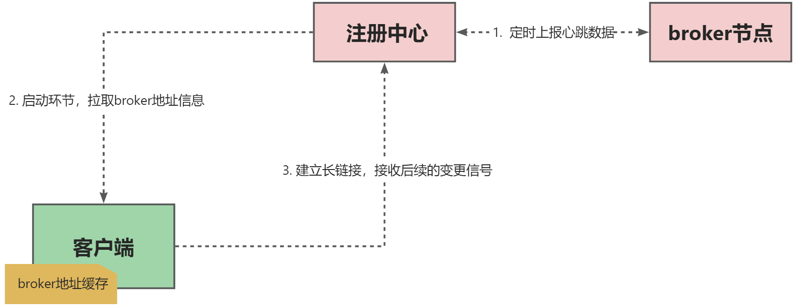

# 存储模块的设计

## MQ的消息存储设计
- 参考 RocketMQ、Kafka 对 log 文件的存储方式

MQ 的存储设计有两种模式：
- 单文件存储。无论是什么 topic，所有消息 message 对象全部往一个文件中追加写，类似 RocketMQ 的 CommitLog 的设计思路。
- 多文件存储。不同 topic 的消息存储在不同的文件块中，类似 Kafka 对于不同的 topic 用不同的 log 文件存储的设计思路

## 消息集群架构思考

### 为什么消息队列还需用到注册中心 

#### 实时变更通知

- broker 节点和注册中心建立长链接，定时上报心跳信息。
- 客户端和注册中心建立连接，启动环节拉取broker地址缓存在本地。
- 后续客户端利用长链接，监听注册中心上broker地址的变更。

注册中心的作用：

常用的注册中心：
- Zookeeper
- Etcd
- Nacos 
- Eureka

