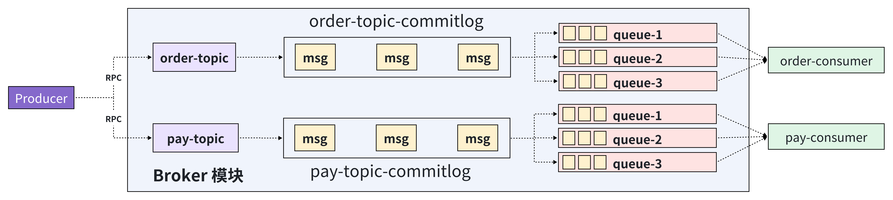

# 消息内容结构体设计

整体的MQ架构回顾：


Producer 发送消息给到 Broker 模块，Broker 的内部会将消息持久化到对应主题的 CommitLog 文件中，接着 CommitLog 持久化完成后需要派发到后续的 Queue 队列里面。

所以，MQ的持久化分为两个阶段：
- 写入 CommitLog
- 派发写入 Queue 文件

CommitLog 的文件存储结构设计：写入 commitLog 的消息结构不能只包含内容，还需要包含消息长度的数据。

Q：为什么要存储消息的体积呢 ？
A: 因为使用 mmap 读取数据的时候，是无法感知一条消息怎样算是读取完整。
```java
```

因此读取逻辑应该是：
1. 首先获取到读取数据的 offset 起点（什么是 offset 的起点）
2. 读 4 个字节，获取 size 的值
3. 加载 size 值大小的字节内容到内存中
   
每条消息之间不需要增加额外的分隔符，减少额外空间浪费使用。 
