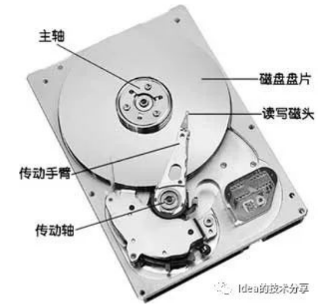
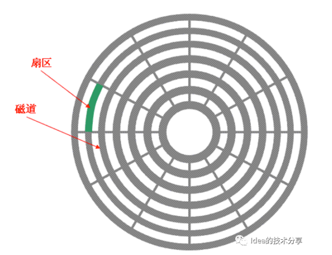
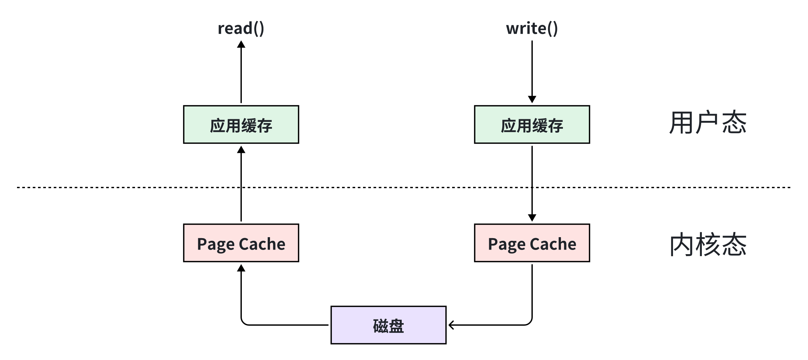
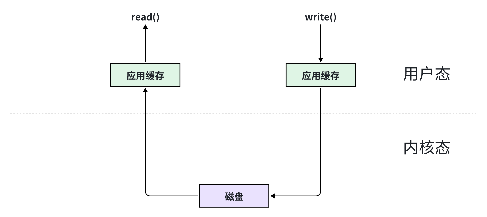
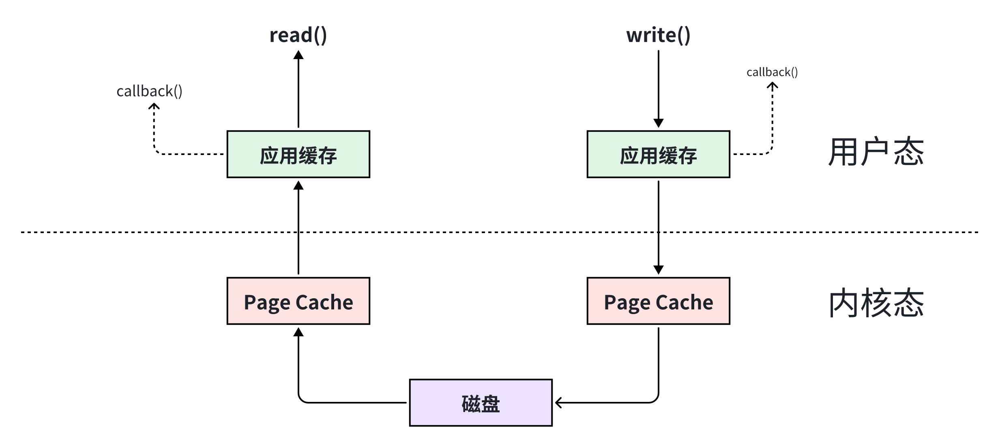

# 传统文件 IO 读写总结

## 磁盘的原理介绍
磁盘的基本结构主要包含有以下几点：磁盘盘片，读写磁盘的指针，传动轴，主轴等。


每次用户程序从用户态发送一条指令给到操作系统内核，进行io读取数据的时候，CPU的内核便会通过io总线发送一个指令到读写磁头，然后由读写磁头定位到盘片的指定位置进行数据读写。最后再通过io总线将数据返回给用户态的程序中。

下面是一张磁盘盘面的大致结构图：


在磁盘的盘面上通常会有许多层的磁道，可以理解为图中的同心圆，然后每层磁道上分有不同范围的扇区，数据存储落在这些扇区的范围当中。磁盘指针头通常会落在盘道的一个位置点，然后朝一定方向旋转进行数据的搜索。


内围的磁道数据其实和外围的扇区数据是一样多的，这也就意味着外围的数据密度要比内围的小很多。现如今采用了**区位记录**的技术进行了优化，保证了密度的均匀性。

# 影响磁盘指针定位数据的性能因素

- 寻道时间：磁盘指针定位到指定的盘道耗时
- 旋转延迟：指针定位到盘道之后进行旋转读取数据
- 数据传输：从内核态将数据传输给到用户态的耗时（涉及CPU上下文切换是比较消耗性能的操作）

## IOPS 指标
磁盘的每秒数据输入输出量，计算思路：1000ms/(数据寻道时间+旋转延迟时间+数据传输时间)。如今的硬件技术开始支持一些分散聚合DMA技术，能够支持将一些原先不连续的磁道数据进行组合读取，效率性更高，由于这种设备支持的磁道信息并不是一定连续的，所以有一个新的概念叫做**段**。


# Linux 2.6 中支持的文件访问方式

## 标准访问文件的方式
在 Linux 中，这种访问文件的方式是通过两个系统调用实现的：`read()` 和 `write()`

- 当应用程序调用 `read()` 系统调用读取一块数据的时候，如果该块数据已经在内存中了，那么就直接从内存中读出该数据并返回给应用程序；
- 如果该块数据不在内存中，那么数据会被从磁盘上读到页缓存中去，然后再从页缓存中拷贝到用户地址空间中去。
  
对于写数据操作来说，当一个进程调用了 `write()` 系统调用往某个文件中写数据的时候，数据会先从用户地址空间拷贝到操作系统内核地址空间的页缓存中去，然后才被写到磁盘上。

但是对于这种标准的访问文件的方式来说，**在数据被写到页缓存中的时候，`write()` 系统调用就算执行完成，并不会等数据完全写入到磁盘上。**

特点：准确性一般，但是快。



## 直接 I/O 的方式

直接I/O的方式就是应用程序直接访问磁盘数据，而不经过操作系统内核数据缓存区，这样做的目的就是减少一次从内核缓冲区到用户程序缓存的数据复制。

特点：准确性高，但是慢。



## 同步访问文件的方式

是数据的读取和写入都是同步操作的，他与标准访问文件的方式不同的是，只有当数据被成功写到磁盘时才返回给应用程序成功的标志。

这种访问文件的方式性能比较差，只有在一些对数据安全性要求比较高的场景中才会使用，而且通常这种操作方式的硬件都是定制的。

特点：准确性高，但是慢。


## 异步访问文件的方式

当访问数据的线程发送请求之后，线程会接着去处理其他事情，而不是阻塞等待，当请求的数据返回后继续处理下面的操作。这种访问文件的方式可以明显的提高应用程序的效率，但是不会改变访问文件的效率。

特点：持久化依靠操作系统页缓存刷盘机制，但是可以解放调用方线程的等待过程。

异步访问文件的方式如下图所示：


## 内存映射的方式
指的是操作系统将内存中的某一块区域与磁盘中的文件关联起来，当要求访问内存中的一段数据时，转换为访问文件的某一段数据。

这种方式的目的是减少数据从内核空间缓存到用户空间缓存的数据复制操作，因为这两个空间的数据是共享的。

特点：持久化依靠操作系统页缓存刷盘机制，但是性能高。（空间换时间）


# Java 中的传统文件IO

## 字节流
```java
    @Test
    public void testFileInputOutput() {
        File file = new File("");
        try (InputStream in = new FileInputStream(file);
             OutputStream out = new FileOutputStream(file);) {

            byte[] content = new byte[1024];
            in.read(content);
            System.out.println(new String(content));

            out.write(("test-content1-" + System.currentTimeMillis()).getBytes());
            out.flush();
        } catch (IOException e) {
            e.printStackTrace();
        }
    }
```

## 字符流
```java
    @Test
    public void testFileReaderWriter() throws IOException {
        File file = new File("");
        // 创建 FileWriter 对象
        FileWriter writer = new FileWriter(file);
        // 向文件中写入内容
        writer.write("test-content2-" + System.currentTimeMillis());
        writer.flush();
        writer.close();

        // 创建FileReader对象，读取文件中的内容
        FileReader reader = new FileReader(file);
        char[] ch = new char[100];
        reader.read(ch);
        for (char c : ch) {
            System.out.println(c);
        }
        reader.close();
    }
```